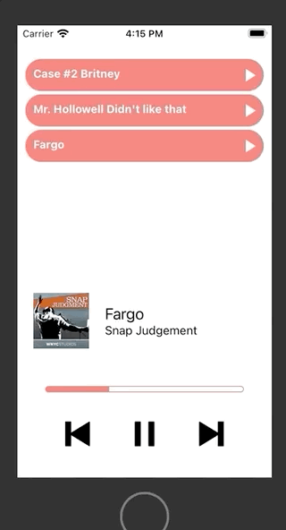

# React Native Audio Player

A react native audio player that allows:

- Lists out the 3 episodes in episodes.json.
- Has a Play button next to each episode that allows you to play the episode.
- Has a section on the bottom of the screen which allows you to:
  - Play
  - Pause
  - Go to the next track
  - Go to the previous track
- displays progress of current playing episode.

Dependencies:

- react-native-track-player
- react-native-vector-icons
- react-native-progress

